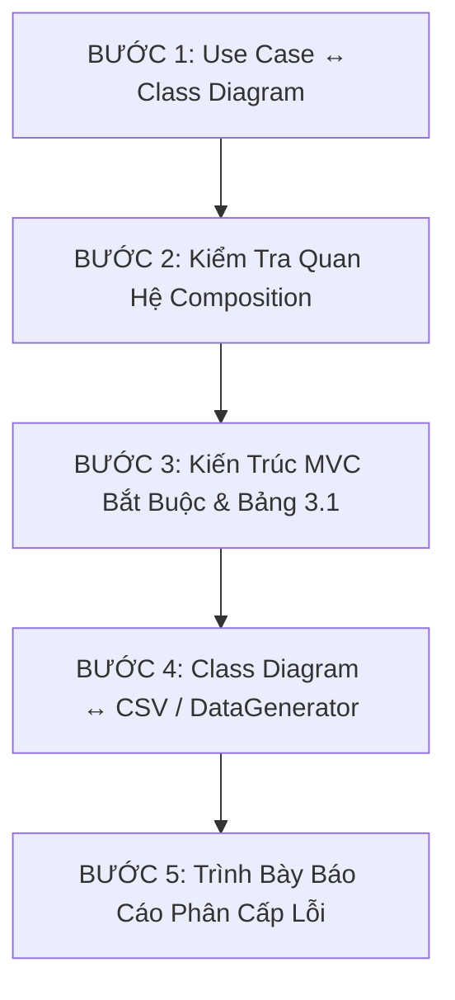

# LAB211 Stadium Ticket Booking Diagram Reviewer

Skill này chuyên trách phân tích, đối chiếu chéo (cross-check) và đánh giá tính nhất quán cho đồ án môn **LAB211: Stadium Ticket Booking Simulation** (Java Core OOP, kiến trúc MVC chặt chẽ, persistence dạng CSV phẳng, kiểm thử đo lường Double Booking dưới môi trường đa luồng sử dụng 3-4 cơ chế đồng bộ hóa như `synchronized`, `ReentrantLock`, `Atomic/CAS`, hoặc non-blocking/concurrent collections).

---

## 🎯 Khi Nào Kích Hoạt Skill
Skill tự động kích hoạt khi người dùng cung cấp bất kỳ dữ liệu nào sau đây:
- Mermaid Class Diagram (`classDiagram`).
- Use Case Diagram (dưới dạng văn bản mô tả, danh sách actor/use case, hoặc diagram).
- File mã nguồn `DataGenerator.java` hoặc mã nguồn Java Entities/Controllers/Repositories.
- File CSV mẫu lưu trữ dữ liệu (vd: `users.csv`, `matches.csv`, `seats.csv`, `bookings.csv`, `tickets.csv`).
- Đi kèm các câu hỏi kiểm tra như: *"kiểm tra", "đúng chưa", "khớp không", "có xung đột gì không", "review class diagram", "đối chiếu use case"*.

---

## 🧭 Quy Trình Đối Chiếu Chéo 5 Bước

Thực hiện kiểm tra theo **đúng thứ tự ưu tiên** từ Bước 1 đến Bước 5. Nếu phát hiện vi phạm ở các bước trước, cần ghi nhận và làm nổi bật theo mức độ nghiêm trọng.

---

### BƯỚC 1 — Đối Chiếu Use Case Diagram ↔ Class Diagram

1. **Khớp 1-1 giữa Use Case Frame và Controller:**
   - Mỗi khung Use Case (ví dụ: `Manage Match`, `Manage Seat`, `Manage Booking`, `Manage User`, `Simulation Run`) **bắt buộc phải có 1 Controller tương ứng** (vd: `MatchController`, `SeatController`, `BookingController`, `UserController`, `SimulationController`).
   - Mọi use case hành động cụ thể nằm trong khung (vd: `Create Match`, `Update Seat Status`, `Hold Seat`, `Book Ticket`, `Cancel Booking`) **phải map khớp 1-1 với public method** trên Controller đó.
   - Báo lỗi nếu:
     - Use case tồn tại nhưng Controller thiếu method thực thi.
     - Method trong Controller thừa mứa, không phục vụ bất kỳ use case nào hoặc phân sai Controller.

2. **Khớp Actor với Tầng Model & Luồng Xác Thực (Login/Logout):**
   - Mọi Actor xuất hiện trong Use Case (`Guest`, `Fan`/`Customer`, `Organizer`, `Admin`):
     - **Không được phép là "actor vô hình"** trong tầng Model.
     - Phải có Entity tương ứng (ví dụ `User` với enum `Role` hoặc các class kế thừa) và `UserRepository`/`UserController`.
     - Phải có đường dẫn đăng nhập/đăng xuất hoạt động được (ví dụ method `login(username, password)`, `logout()` trong `AuthController` hoặc `UserController`).

---

### BƯỚC 2 — Kiểm Tra Vi Phạm Nguyên Tắc Composition & Quan Hệ

1. **Luật Độc Quyền Composition (`*--`):**
   - Trong UML, quan hệ Composition (`*--`) biểu thị quan hệ sở hữu sinh-tử (phụ thuộc vòng đời tồn tại).
   - **Một Entity chỉ được phép có ĐÚNG 1 chủ sở hữu Composition (`*--`).**
   - 🔴 **VI PHẠM NGHIÊM TRỌNG:** Nếu 2 class khác nhau cùng chỉ mũi tên Composition (`*--`) vào cùng 1 class thứ 3 (Ví dụ: cả `Match` và `Stadium` đều `*--` vào `Seat`).
     - **Giải pháp bắt buộc:** Đề xuất hạ 1 quan hệ xuống Aggregation (`o--`) hoặc Association (`-->`), hoặc xóa hẳn quan hệ đối tượng nếu bản chất chỉ là lưu ID dạng khóa ngoại (Foreign Key - FK).
2. **Tham Chiếu ID Phẳng (CSV-friendly FK):**
   - Trong kiến trúc lưu trữ CSV phẳng (Flat File Persistence):
     - Việc lưu `matchId: String`, `userId: String`, `seatId: String` trong `Booking` hay `Ticket` chỉ là thuộc tính nguyên thủy/String.
     - **KHÔNG** được vẽ mũi tên Composition/Association dày đặc cho các tham chiếu ID này nếu không chứa object reference trực tiếp trong Java Entity. Giữ diagram gọn gàng và phản ánh đúng entity model.

---

### BƯỚC 3 — Kiểm Tra Kiến Trúc MVC Bắt Buộc (Đối Chiếu Bảng 3.1 Đề Bài)

Kiểm tra nghiêm ngặt sự phân tách trách nhiệm giữa các tầng:

| Tầng | Vai trò & Quy tắc bất di bất dịch | Dấu hiệu vi phạm cần bắt lỗi |
| :--- | :--- | :--- |
| **Model** | - Kế thừa `BaseEntity` (phải có các abstract method: `toCsvLine()`, `fromCsvLine(String)`, `getId()`). - Chỉ đóng gói dữ liệu thuộc tính (POJO/JavaBean) và validation nội tại. - **KHÔNG ĐƯỢC CHỨA** method thao tác trên tập hợp/danh sách (như `viewAll()`, `search()`, `filter()`, `sortByPrice()`). | Entity chứa `List<T>`, chứa logic lọc, tìm kiếm, tính toán tổng doanh thu toàn hệ thống. |
| **Repository** | - Phải kế thừa lớp generic `CsvRepository<T extends BaseEntity>` hoặc interface `IRepository<T>`. - **KHÔNG ĐƯỢC** lặp lại code CRUD (đọc ghi file CSV phải dùng chung logic generic từ base class). - Chỉ bổ sung các method tìm kiếm đặc thù nếu cần (vd: `findByUsername`, `findByMatchId`). | Mỗi Repository tự mở `BufferedReader`/`BufferedWriter` viết lại toàn bộ code đọc/ghi file từ đầu. |
| **Controller** | - Điều phối luồng nghiệp vụ giữa View và Repository. - Được phép gọi Repository để lấy/lưu dữ liệu. - **KHÔNG ĐƯỢC TỰ GIỮ** mảng/List dữ liệu riêng làm state độc lập (đây là dấu hiệu anti-pattern đang lén đọc/ghi file trực tiếp hoặc bypass Repository). | Controller có field `private List<Match> matches = new ArrayList<>();` tự quản lý vòng đời không qua Repository. |
| **View / UI** | - Chỉ phụ trách hiển thị dữ liệu ra Console/CLI và nhận input từ người dùng. - Gọi Controller để xử lý. - **Tuyệt đối KHÔNG** chứa logic nghiệp vụ, tính toán tiền, xử lý concurrency hoặc gọi trực tiếp Repository. | View tự import `UserRepository` hoặc tự tính giá vé sau giảm giá. |
| **Concurrency Simulation** | - Module mô phỏng đặt vé nhiều luồng để đo lường tỷ lệ Double Booking. - Phải tách biệt cơ chế đồng bộ (Strategy Pattern hoặc tham số hóa cơ chế: `Synchronized`, `ReentrantLock`, `Atomic/CAS`, `Unsafe/No-Lock`). | Logic khóa (Locking) bị nhét lẫn lộn vào Entity hoặc View. |

---

### BƯỚC 4 — Đối Chiếu Class Diagram ↔ CSV Thật / DataGenerator.java

*(Áp dụng khi người dùng đính kèm file CSV hoặc code DataGenerator.java)*

1. **Khớp Cột CSV ↔ Thuộc Tính Entity:**
   - Thứ tự các cột trong CSV phải khớp **CHÍNH XÁC 100%** với thứ tự parse trong hàm `fromCsvLine()` / `toCsvLine()` và thứ tự thuộc tính trong Entity.
   - Kiểu dữ liệu phải tương thích (VD: `price` là `double`/`BigDecimal`, `dateTime` là `LocalDateTime` theo định dạng chuẩn ISO hoặc pattern xác định).
2. **Kiểm Tra & Chuẩn Hóa Enum (State / Type):**
   - Giá trị enum trong Class Diagram (ví dụ: `SeatStatus: AVAILABLE, HELD, BOOKED`) phải khớp với chuỗi string thực tế được ghi ra CSV bởi `DataGenerator`.
   - **Báo lỗi Enum "Chết":** Enum được định nghĩa trong Class Diagram nhưng không bao giờ xuất hiện trong mã nguồn hoặc CSV.
   - **Báo lỗi Giá trị Ngoại Lai:** CSV chứa giá trị không nằm trong danh sách hằng số Enum.
3. **Đồng Bộ Khái Niệm Giữa Các Entity:**
   - Nếu hai Entity cùng biểu diễn 1 khái niệm trạng thái (ví dụ trạng thái hoạt động của tài khoản `UserStatus` và trạng thái xác thực `OrganizerApprovalStatus`), kiểm tra xem có thể chuẩn hóa hoặc gom nhóm thành enum chung để tránh phân mảnh logic hay không.

---

### BƯỚC 5 — Định Dạng & Trình Bày Báo Cáo

Khi xuất kết quả, **luôn tuân thủ định dạng 3 mức độ nghiêm trọng**:

- 🔴 **[NGHIÊM TRỌNG] (Critical Error):** Lỗi dẫn tới crash chương trình, vi phạm cấu trúc OOP căn bản, vi phạm MVC (như đa sở hữu Composition, Controller lưu state trực tiếp, Entity chứa logic repository, thiếu actor trong Model).
- 🟡 **[CẦN SỬA] (Warning / Improvement):** Lệch tên cột, enum chưa tối ưu, thiếu mapping use case phụ, đặt tên method chưa chuẩn convention Java.
- 🟢 **[ĐẠT CHUẨN] (Passed / Well Done):** Các điểm đã làm tốt, tuân thủ đúng kiến trúc MVC, sạch sẽ, giữ nguyên.

#### Yêu Cầu Chi Tiết Cho Từng Lỗi:
1. Nêu rõ: **Vị trí vi phạm** (Tên Class, Method, Thuộc tính, hoặc Dòng CSV).
2. Nêu rõ: **Lý do vi phạm** (Tại sao sai theo tiêu chuẩn LAB211).
3. Đưa ra **Giải pháp cụ thể kèm Code / Mermaid snippet sửa mẫu** (diff hoặc block code thay thế trực tiếp), không trả lời chung chung.
4. ⚠️ **Nguyên Tắc Đính Chính (Self-Correction):** Nếu trong các câu trả lời trước đó của AI từng đưa ra gợi ý **SAI** hoặc mâu thuẫn với Use Case gốc / nguyên tắc MVC, phải **chủ động thừa nhận và đính chính rõ ràng**, tuyệt đối không im lặng sửa lại.

---

## 📚 Baseline Tham Khảo Chuẩn (Mermaid Baseline)

Khi cần đối chiếu với một cấu trúc Class Diagram chuẩn MVC mẫu cho bài toán Stadium Booking, tham khảo file [baseline-class-diagram.md](file:///d:/Luyen-tap/test-lab211/.agents/skills/lab211-diagram-reviewer/resources/baseline-class-diagram.md).
