# Baseline Class Diagram Chuẩn Cho Đề Tài Stadium Ticket Booking (LAB211)

Dưới đây là thiết kế Mermaid Class Diagram mẫu đạt chuẩn kiến trúc MVC, tuân thủ nguyên tắc Generic Repository CSV, mô hình hóa Concurrency Strategy và quan hệ thực thể OOP không vi phạm Composition. Dùng làm thước đo đối chiếu (baseline) khi review bài của sinh viên.

```mermaid
classDiagram
    %% =======================
    %% BASE & PERSISTENCE LAYER
    %% =======================
    class BaseEntity {
        <<abstract>>
        #String id
        +getId() String
        +setId(String id) void
        +toCsvLine()* String
        +fromCsvLine(String csvLine)* void
    }

    class IRepository~T~ {
        <<interface>>
        +findAll() List~T~
        +findById(String id) Optional~T~
        +save(T entity) boolean
        +update(T entity) boolean
        +deleteById(String id) boolean
    }

    class CsvRepository~T~ {
        <<abstract>>
        #String filePath
        #List~T~ cacheList
        +findAll() List~T~
        +findById(String id) Optional~T~
        +save(T entity) boolean
        +update(T entity) boolean
        +deleteById(String id) boolean
        #loadFromFile() void
        #saveToFile() void
        #parseEntity(String line)* T
    }

    IRepository <|.. CsvRepository : implements
    CsvRepository ..> BaseEntity : manages T extends BaseEntity

    %% =======================
    %% ENUMS
    %% =======================
    class UserRole {
        <<enumeration>>
        GUEST
        FAN
        ORGANIZER
        ADMIN
    }

    class SeatStatus {
        <<enumeration>>
        AVAILABLE
        HELD
        BOOKED
    }

    class BookingStatus {
        <<enumeration>>
        PENDING
        CONFIRMED
        CANCELLED
    }

    class LockMechanismType {
        <<enumeration>>
        NO_LOCK
        SYNCHRONIZED_METHOD
        REENTRANT_LOCK
        ATOMIC_CAS
    }

    %% =======================
    %% MODEL ENTITIES
    %% =======================
    class User {
        -String username
        -String passwordHash
        -String fullName
        -UserRole role
        +toCsvLine() String
        +fromCsvLine(String csvLine) void
    }

    class Stadium {
        -String name
        -String address
        -int totalSeats
        +toCsvLine() String
        +fromCsvLine(String csvLine) void
    }

    class Match {
        -String matchName
        -String stadiumId
        -LocalDateTime startTime
        -String organizerId
        +toCsvLine() String
        +fromCsvLine(String csvLine) void
    }

    class Seat {
        -String matchId
        -String seatCode
        -double price
        -SeatStatus status
        +toCsvLine() String
        +fromCsvLine(String csvLine) void
    }

    class Booking {
        -String userId
        -String matchId
        -String seatId
        -LocalDateTime bookingTime
        -BookingStatus status
        +toCsvLine() String
        +fromCsvLine(String csvLine) void
    }

    BaseEntity <|-- User
    BaseEntity <|-- Stadium
    BaseEntity <|-- Match
    BaseEntity <|-- Seat
    BaseEntity <|-- Booking

    User --> UserRole
    Seat --> SeatStatus
    Booking --> BookingStatus

    %% QUAN HỆ SỞ HỮU (Chỉ duy nhất 1 owner composition cho phần tử phụ thuộc)
    %% Lưu ý: Seat gắn với 1 Match cụ thể trong buổi diễn ra
    Match "1" *-- "many" Seat : contains seats of match
    %% Stadium chỉ liên kết tham chiếu qua stadiumId (FK phẳng), không đồng sở hữu Seat bằng Composition

    %% =======================
    %% REPOSITORIES (Specific)
    %% =======================
    class UserRepository {
        +findByUsername(String username) Optional~User~
    }
    class MatchRepository {
        +findByOrganizerId(String organizerId) List~Match~
    }
    class SeatRepository {
        +findByMatchId(String matchId) List~Seat~
        +findAvailableSeats(String matchId) List~Seat~
    }
    class BookingRepository {
        +findByUserId(String userId) List~Booking~
        +findBySeatId(String seatId) Optional~Booking~
    }

    CsvRepository <|-- UserRepository
    CsvRepository <|-- MatchRepository
    CsvRepository <|-- SeatRepository
    CsvRepository <|-- BookingRepository

    %% =======================
    %% CONCURRENCY SIMULATION
    %% =======================
    class BookingStrategy {
        <<interface>>
        +bookSeat(String matchId, String seatId, String userId) boolean
    }

    class SynchronizedBookingStrategy {
        +bookSeat(String matchId, String seatId, String userId) boolean
    }
    class ReentrantLockBookingStrategy {
        -ReentrantLock lock
        +bookSeat(String matchId, String seatId, String userId) boolean
    }
    class AtomicCasBookingStrategy {
        +bookSeat(String matchId, String seatId, String userId) boolean
    }
    class UnsafeNoLockBookingStrategy {
        +bookSeat(String matchId, String seatId, String userId) boolean
    }

    BookingStrategy <|.. SynchronizedBookingStrategy
    BookingStrategy <|.. ReentrantLockBookingStrategy
    BookingStrategy <|.. AtomicCasBookingStrategy
    BookingStrategy <|.. UnsafeNoLockBookingStrategy

    class SimulationService {
        -BookingStrategy strategy
        +runSimulation(int totalThreads, int totalRequests) SimulationResult
    }
    SimulationService --> BookingStrategy

    %% =======================
    %% CONTROLLERS (Map 1-1 với Use Case Frames)
    %% =======================
    class AuthController {
        -UserRepository userRepo
        +login(String username, String password) Optional~User~
        +register(User user) boolean
        +logout() void
    }

    class MatchController {
        -MatchRepository matchRepo
        +createMatch(Match match) boolean
        +updateMatch(Match match) boolean
        +getMatchesByOrganizer(String organizerId) List~Match~
        +getAllMatches() List~Match~
    }

    class SeatController {
        -SeatRepository seatRepo
        +getSeatsByMatch(String matchId) List~Seat~
        +updateSeatPrice(String seatId, double price) boolean
    }

    class BookingController {
        -BookingRepository bookingRepo
        -SeatRepository seatRepo
        -BookingStrategy bookingStrategy
        +bookSeat(String userId, String seatId) boolean
        +cancelBooking(String bookingId) boolean
        +getUserBookings(String userId) List~Booking~
    }

    class SimulationController {
        -SimulationService simulationService
        +setupSimulation(LockMechanismType mechanism, int threads) void
        +executeBenchmark() SimulationResult
    }

    AuthController --> UserRepository
    MatchController --> MatchRepository
    SeatController --> SeatRepository
    BookingController --> BookingRepository
    BookingController --> SeatRepository
    BookingController --> BookingStrategy
    SimulationController --> SimulationService
```

### Các Điểm Đáng Chú Ý Về Mặt Thiết Kế:
1. **Model hoàn toàn POJO:** `Seat`, `Match`, `User`, `Booking` chỉ chứa attributes, getters/setters và serialization CSV. Không có `search()`, `sort()`, `save()` trong Entity.
2. **Composition độc quyền:** `Seat` chỉ có 1 quan hệ composition `Match *-- Seat`. `Stadium` không composition vào `Seat` (tránh đa chủ sở hữu).
3. **Controller không lưu cache state riêng:** Dữ liệu luôn được đọc/ghi thông qua Repository.
4. **Strategy Pattern cho Concurrency:** Tách rời 4 cơ chế đo lường Double Booking (`No-Lock`, `Synchronized`, `ReentrantLock`, `Atomic CAS`) để dễ so sánh metrics (độ trễ, số lượng xung đột double-booking).
